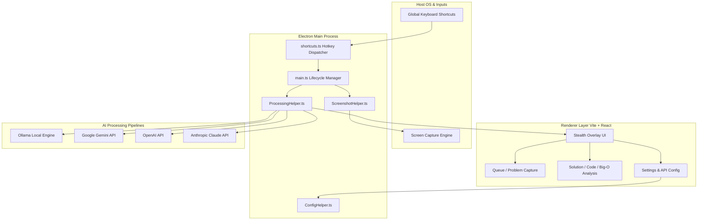
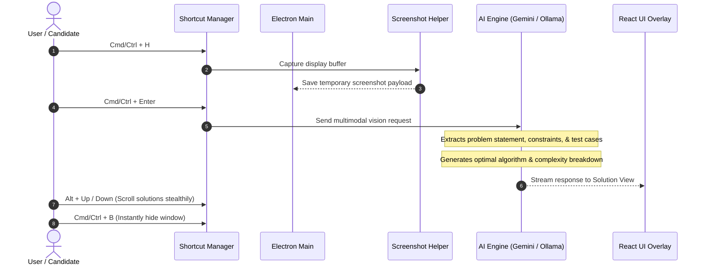

<div align="center">

# ⚡ Open Interview Coder

**The Ultimate Open-Source, Stealth Desktop AI Copilot for Technical Coding Assessments & Interviews**

[](LICENSE)
[](#cross-platform-support)
[](https://nodejs.org/)
[](https://www.electronjs.org/)
[](https://react.dev/)
[](https://www.typescriptlang.org/)
[](https://github.com/Abhinav-kp-dev/open-interview)

<p align="center">
  <a href="#-key-features">Key Features</a> •
  <a href="#-supported-ai-providers">AI Models & Providers</a> •
  <a href="#-quick-start">Quick Start</a> •
  <a href="#-global-keyboard-shortcuts">Hotkeys</a> •
  <a href="#-architecture--workflow">Architecture</a> •
  <a href="#-configuration">Configuration</a> •
  <a href="#-building--packaging">Packaging</a>
</p>

</div>

---

## 📖 Overview

**Open Interview Coder** is an unobtrusive, lightweight desktop application engineered to assist developers during algorithmic coding interviews, live technical problem solving, and online assessments (LeetCode, HackerRank, CodeSignal, etc.). 

Running as an ultra-low-profile, always-on-top transparent overlay, the application allows you to capture problems straight from your screen using global hotkeys, parses the problem statement, inputs, and constraints using advanced Multimodal Vision AI, and renders optimal code solutions, algorithmic explanations, time/space complexities, and debugging suggestions—**completely hands-free without ever losing focus from your editor or browser**.

---

## 🚀 Key Features

- 🥷 **Full Stealth Overlay Mode**
  - Instant visibility toggle with `Cmd/Ctrl + B`.
  - Dynamic opacity adjustment (`Cmd/Ctrl + [` and `]`) from 10% translucent to 100% opaque.
  - Transparent click-through and non-activating window flags so screen recorders and assessment anti-cheat software do not capture focus changes.
- 📸 **One-Click Vision Problem Extraction**
  - Instant background screenshot capture with `Cmd/Ctrl + H`.
  - AI Vision extracts problem descriptions, examples, constraints, and edge cases with zero manual copy-pasting.
- 🧠 **Multi-Provider AI Engine**
  - **Google Gemini**: Tested and optimized for free-tier Google AI Studio keys (`gemini-2.5-flash`, `gemini-3.1-flash-lite`).
  - **Ollama (100% Offline & Free)**: Zero API cost, private local model execution (`llama3.2-vision`, `qwen2.5-coder`).
  - **OpenAI**: State-of-the-art reasoning models (`gpt-4o`, `gpt-4o-mini`, `o1`, `o3-mini`).
  - **Anthropic Claude**: Premier coding capabilities (`claude-3-7-sonnet`, `claude-3-5-sonnet`).
- ⚡ **Zero Subscriptions & Zero Paywalls**
  - Fully open-source with 100% unlocked functionality.
  - Bring your own API key or run completely local and offline via Ollama.
- 💻 **Multi-Language Generation**
  - Optimized solutions in Python, C++, Java, JavaScript, TypeScript, Go, Rust, and C#.
  - Clean syntax highlighting, algorithmic intuition, step-by-step breakdown, and Big-O complexity analysis.
- ⌨️ **Comprehensive Global Keyboard Controls**
  - Reposition the overlay (`Cmd/Ctrl + Arrows`), scroll without focusing (`Alt + Up/Down`), adjust zoom, and clear queues entirely via shortcuts.

---

## 🤖 Supported AI Providers

Open Interview Coder separates problem processing into three distinct model pipelines: **Extraction (Vision)**, **Solution Generation (Reasoning)**, and **Debugging (Code Review)**.

| Provider | Recommended Models | Vision Support | Cost | Privacy |
| :--- | :--- | :---: | :---: | :---: |
| **Google Gemini** | `gemini-2.5-flash`<br>`gemini-3.1-flash-lite` | ✅ Yes | **Free Tier Available** | Cloud |
| **Ollama (Local)** | `llama3.2-vision:11b`<br>`qwen2.5-coder:7b` | ✅ Yes | **100% Free** | **100% Offline / Local** |
| **OpenAI** | `gpt-4o`<br>`gpt-4o-mini`<br>`o3-mini` | ✅ Yes | Paid API | Cloud |
| **Anthropic Claude** | `claude-3-7-sonnet`<br>`claude-3-5-sonnet` | ✅ Yes | Paid API | Cloud |

---

## ⌨️ Global Keyboard Shortcuts

Control the entire application without clicking out of your IDE or active window:

| Shortcut | Function | Description |
| :--- | :--- | :--- |
| <kbd>Cmd/Ctrl</kbd> + <kbd>B</kbd> | **Toggle Visibility** | Instantly hides or reveals the overlay window |
| <kbd>Cmd/Ctrl</kbd> + <kbd>H</kbd> | **Capture Screen** | Takes a screenshot of your active display and queues it |
| <kbd>Cmd/Ctrl</kbd> + <kbd>Enter</kbd> | **Solve Problem** | Submits captured screenshots and prompts to the AI engine |
| <kbd>Cmd/Ctrl</kbd> + <kbd>.</kbd> | **Cancel Request** | Aborts in-flight AI requests immediately |
| <kbd>Cmd/Ctrl</kbd> + <kbd>[</kbd> / <kbd>]</kbd> | **Adjust Opacity** | Cycles window transparency (translucent ↔ opaque) |
| <kbd>Cmd/Ctrl</kbd> + <kbd>↑</kbd> / <kbd>↓</kbd> / <kbd>←</kbd> / <kbd>→</kbd> | **Move Window** | Repositions the overlay across your desktop |
| <kbd>Alt</kbd> + <kbd>↑</kbd> / <kbd>↓</kbd> | **Silent Scroll** | Scrolls the solution pane without taking keyboard focus |
| <kbd>Cmd/Ctrl</kbd> + <kbd>R</kbd> | **Reset View** | Clears active queue and returns to the initial capture screen |
| <kbd>Cmd/Ctrl</kbd> + <kbd>/</kbd> | **Focus Input** | Focuses the custom prompt / instructions text input |
| <kbd>Cmd/Ctrl</kbd> + <kbd>Shift</kbd> + <kbd>L</kbd> | **Clear Screenshots** | Clears all pending screenshots from the queue |
| <kbd>Cmd/Ctrl</kbd> + <kbd>-</kbd> / <kbd>0</kbd> / <kbd>=</kbd> | **Zoom Control** | Zoom out, reset zoom (100%), or zoom in |
| <kbd>Cmd/Ctrl</kbd> + <kbd>Q</kbd> | **Quit App** | Closes and terminates the background Electron process |

---

## 🛠️ Architecture & Workflow

### High-Level Architecture



### Execution Flow



---

## 📦 Quick Start & Installation

### Prerequisites
- **Node.js**: `v18.x` or `v20.x` (LTS recommended)
- **npm** or **bun**
- (Optional) **Ollama** if you prefer 100% offline local processing:
  ```bash
  # Install Ollama from https://ollama.ai/ then pull vision and coder models:
  ollama pull llama3.2-vision:11b
  ollama pull qwen2.5-coder:7b
  ```

### 1. Clone & Install

```bash
git clone https://github.com/Abhinav-kp-dev/open-interview.git
cd open-interview

npm install
```

### 2. Configure API Provider

You can configure your provider inside the GUI (Gear icon in the top header) or edit your local config directly:

#### Option A: Google Gemini (Free Tier Recommended)
1. Get a free API key at [Google AI Studio](https://aistudio.google.com/).
2. In Settings, select **Gemini** and paste your key.
3. The app is pre-configured to use **`gemini-2.5-flash`** for both Vision extraction and code generation.

#### Option B: Ollama (Local & Free)
1. Start your local Ollama server (`ollama serve`).
2. In Settings, choose **Ollama**, set your host (`http://localhost:11434`), and select your installed models.

#### Option C: OpenAI or Anthropic
1. In Settings, select **OpenAI** or **Anthropic**.
2. Paste your API key and choose your preferred model tier (`gpt-4o`, `claude-3-7-sonnet`, etc.).

### 3. Launching the App

#### Development Mode (with Live Reload / HMR)
```bash
npm run dev
```

#### Production Mode
```bash
npm run build
npm run run-prod
```

#### Stealth One-Click Launchers
- **macOS / Linux**:
  ```bash
  chmod +x stealth-run.sh
  ./stealth-run.sh
  ```
- **Windows**:
  ```cmd
  .\stealth-run.bat
  ```

---

## ⚙️ Configuration & Storage

User preferences, API keys, and selected models are stored securely in local configuration files:

- **macOS**: `~/Library/Application Support/Electron/config.json`
- **Windows**: `%APPDATA%\Electron\config.json`
- **Linux**: `~/.config/Electron/config.json`

### Example `config.json`

```json
{
  "apiKey": "YOUR_GEMINI_OR_OPENAI_KEY",
  "apiProvider": "gemini",
  "extractionModel": "gemini-2.5-flash",
  "solutionModel": "gemini-2.5-flash",
  "debuggingModel": "gemini-2.5-flash",
  "language": "python",
  "opacity": 0.9,
  "superadminMode": true,
  "debugMenuEnabled": false,
  "ollamaHost": "http://localhost:11434"
}
```

---

## 🛠️ Project Structure

```
open-interview/
├── electron/                  # Electron main process source
│   ├── main.ts                # Application lifecycle & stealth window config
│   ├── shortcuts.ts           # Global hotkey registration & event dispatch
│   ├── ProcessingHelper.ts    # Multimodal AI prompt pipeline (Gemini, Ollama, OpenAI, Claude)
│   ├── ScreenshotHelper.ts    # Screen capture buffer management
│   ├── ConfigHelper.ts        # Model provider sanitize & local config manager
│   ├── MemoryHelper.ts        # Long-term context & candidate history memory
│   ├── ipcHandlers.ts         # IPC bridge endpoints between Main & UI
│   └── preload.ts             # Safe Electron context bridge
├── src/                       # React frontend (Vite renderer)
│   ├── _pages/                # Core views (Queue, Solutions, Debug)
│   ├── components/            # Reusable UI components & dialogs
│   │   ├── Header/            # Top bar, status indicator, action controls
│   │   ├── Queue/             # Screenshot queue & input prompts
│   │   ├── Solutions/         # Formatted code, explanation, and Big-O breakdown
│   │   └── Settings/          # Provider & Model selection modal
│   ├── contexts/              # Global React state (Toasts, Config, Models)
│   ├── lib/                   # API clients & utility helpers
│   ├── App.tsx                # Application layout & navigation
│   └── index.css              # Custom Tailwind CSS styling & animations
├── build/                     # App build assets & OS entitlement plists
├── stealth-run.sh             # Unix stealth runner script
├── stealth-run.bat            # Windows stealth runner script
├── vite.config.ts             # Vite bundler & Electron plugin setup
└── package.json               # Dependencies and build targets
```

---

## 🏗️ Building & Packaging

To compile standalone desktop executables and installers:

```bash
# Package for your current operating system:
npm run package

# Build macOS installer (.dmg / .zip):
npm run package-mac

# Build Windows NSIS installer (.exe):
npm run package-win
```

Installers and distribution binaries will be located in the `release/` directory.

---

## 🛡️ Privacy & Security Best Practices

1. **Local Model Privacy**: When using Ollama, no screen captures, code snippets, or prompts ever leave your machine.
2. **Never Commit Secrets**: The project's `.gitignore` automatically blocks `.env`, local `config.json` secrets, and build output directories.
3. **Ephemeral Storage**: Screenshots captured during a session are stored only temporarily in your local OS temp folder and are automatically cleared.

---

## 🤝 Contributing

Contributions, bug reports, and feature requests are welcome!

1. Fork the repository: [https://github.com/Abhinav-kp-dev/open-interview](https://github.com/Abhinav-kp-dev/open-interview)
2. Create your feature branch (`git checkout -b feature/amazing-feature`)
3. Commit your changes (`git commit -m 'Add amazing feature'`)
4. Push to the branch (`git push origin feature/amazing-feature`)
5. Open a Pull Request

---

## ⚖️ License & Disclaimer

This project is licensed under the **GNU Affero General Public License v3.0 (AGPL-3.0)**. See the [LICENSE](LICENSE) file for details.

> **Disclaimer**: This tool is developed for educational purposes, coding practice, and personal algorithmic assessment preparation. Users are responsible for adhering to the ethical guidelines and honor codes of their respective interview platforms and organizations.
