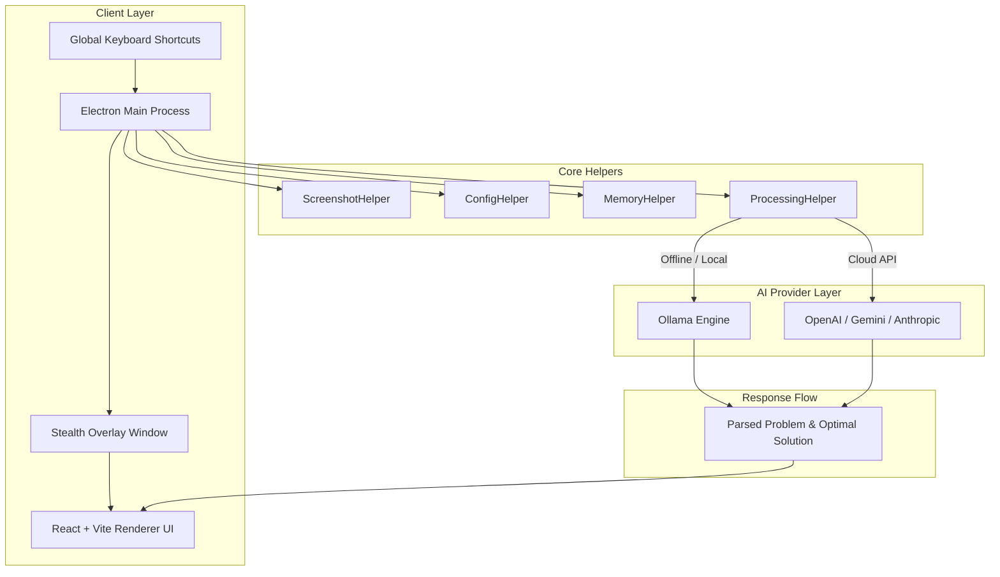
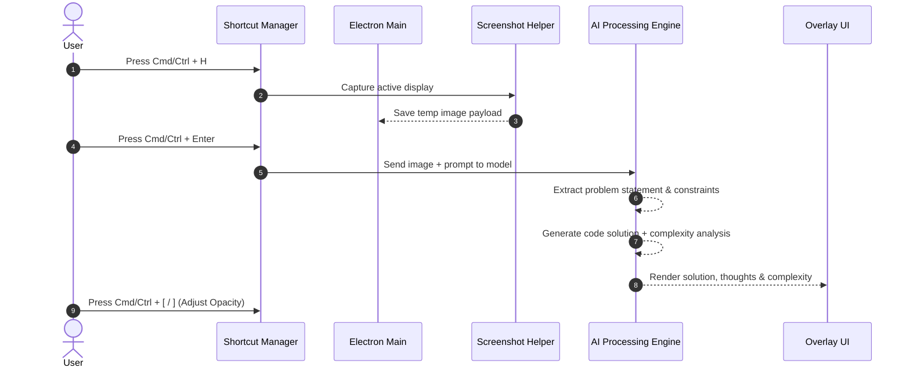

# Interview Coder (Unlocked Edition)

An open-source, stealth desktop AI assistant designed for coding interviews, live technical assessments, and algorithmic problem-solving. Interview Coder runs as an unobtrusive, customizable screen overlay that captures coding problems from your display and generates step-by-step solutions, thoughts, and complexity analysis using local or cloud AI models.

---

## Key Features

- **Stealth Overlay Interface**: Invisible by default (`Cmd/Ctrl + B`). Operates as a floating, top-most window with adjustable opacity and shortcut-driven movement so it never interrupts your active IDE or browser session.
- **Automated Problem Extraction**: Captures problem statements, constraints, and test cases directly from screenshots (`Cmd/Ctrl + H`) using AI vision models.
- **Local & Privacy-First AI**: Native support for **Ollama** (`llama3.2-vision`, `qwen2.5-coder`), enabling 100% offline usage with zero API cost and complete data privacy.
- **Cloud Provider Integration**: Supports **OpenAI** (GPT-4o), **Anthropic** (Claude 3.5 Sonnet), and **Google Gemini** for high-accuracy cloud processing when requested.
- **Multi-Language Solution Engine**: Generates optimal code, step-by-step breakdown, and algorithmic time/space complexities in Python, C++, Java, JavaScript, TypeScript, Go, Rust, and more.
- **Global Keyboard Control**: Full control over window position, zoom, transparency, capture, and cancellation without shifting focus from your coding environment.
- **Zero Cloud Lock-in**: Fully unlocked with zero authentication, login screens, or recurring subscriptions. Configuration is saved locally in `config.json`.

---

## Architecture Overview

Interview Coder combines an **Electron main process** managing global hotkeys, stealth overlay properties, and system-level screen capture with a **Vite + React frontend** and a flexible **AI Provider Engine**.

### System Architecture



### Execution Workflow



---

## Technology Stack

- **Desktop Framework**: Electron 29, Node.js, TypeScript
- **UI & Frontend**: React 18, Vite 6, Tailwind CSS, Radix UI, Lucide Icons
- **AI Integrations**: Ollama REST API, `@anthropic-ai/sdk`, `openai`, `@supabase/supabase-js` (local storage client)
- **Utilities**: `screenshot-desktop`, `concurrently`, `cross-env`, `electron-builder`

---

## Prerequisites

Before setting up the project, ensure you have the following installed on your system:

- **Node.js**: `v18.x` or `v20.x` (LTS recommended)
- **Package Manager**: `npm` (v9+) or `bun`
- **Ollama** (Recommended for free, offline usage):
  - Download and install [Ollama](https://ollama.ai/)
  - Pull recommended vision and coding models:
    ```bash
    ollama pull llama3.2-vision:11b
    ollama pull qwen2.5-coder:7b
    ```

---

## Installation & Quick Start

1. **Clone the repository**:
   ```bash
   git clone https://github.com/ibttf/interview-coder.git
   cd interview-coder
   ```

2. **Install dependencies**:
   ```bash
   npm install
   ```

3. **Configure Settings**:
   Launch the app in development mode or open the settings dialog (gear icon) in the app UI to configure your preferred AI provider (Ollama, OpenAI, Gemini, or Anthropic) and API keys.

---

## Environment Variables & Configuration

The application operates out of a local `config.json` file stored in your user data directory (`%APPDATA%/interview-coder-v1/config.json` on Windows, `~/Library/Application Support/interview-coder-v1/config.json` on macOS).

Optionally, you can create a `.env` file in the root directory for development defaults:

```env
NODE_ENV=development
ELECTRON_DISABLE_GPU=1
OLLAMA_HOST=http://localhost:11434
OPENAI_API_KEY=your_openai_key_here
ANTHROPIC_API_KEY=your_anthropic_key_here
GEMINI_API_KEY=your_gemini_key_here
```

---

## Global Keyboard Shortcuts

| Shortcut | Action Description |
| :--- | :--- |
| **`Cmd/Ctrl + B`** | Toggle overlay window visibility (Hide / Show) |
| **`Cmd/Ctrl + H`** | Capture screenshot of active display & queue input |
| **`Cmd/Ctrl + Enter`** | Submit captured inputs to AI engine for processing |
| **`Cmd/Ctrl + .`** | Cancel active AI request immediately |
| **`Cmd/Ctrl + Backspace`** | Clear queued text input |
| **`Cmd/Ctrl + /`** | Focus prompt input field |
| **`Cmd/Ctrl + R`** | Reset queues, cancel processing, and return to queue view |
| **`Cmd/Ctrl + [` / `]`** | Decrease / Increase window opacity (Translucent ↔ Opaque) |
| **`Cmd/Ctrl + Arrows`** | Reposition window (Left, Right, Up, Down) |
| **`Alt + Up / Down`** | Scroll content up or down without taking focus |
| **`Cmd/Ctrl + - / 0 / =`** | Zoom out / Reset zoom / Zoom in |
| **`Cmd/Ctrl + Shift + L`** | Delete all screenshots in active queue |
| **`Cmd/Ctrl + Q`** | Quit application |

---

## Development & Production Usage

### Development Mode

Run Vite and Electron concurrently with hot module replacement (HMR):

```bash
npm run dev
```

### Production Build & Local Launch

Build the TypeScript components and launch Electron in production mode:

```bash
npm run build
npm run run-prod
```

### Stealth Launcher Scripts

Pre-configured stealth startup scripts build the app and launch it directly into background overlay mode:

- **Windows**:
  ```cmd
  .\stealth-run.bat
  ```
- **macOS / Linux**:
  ```bash
  chmod +x stealth-run.sh
  ./stealth-run.sh
  ```

---

## Project Structure

```
interview-coder/
├── electron/                  # Electron main process source
│   ├── main.ts                # Application lifecycle & window management
│   ├── shortcuts.ts           # Global hotkey listener registry
│   ├── ProcessingHelper.ts    # AI prompt pipeline & solution generation
│   ├── ScreenshotHelper.ts    # Display capture utilities
│   ├── ConfigHelper.ts        # Local config persistence (config.json)
│   ├── MemoryHelper.ts        # Context & memory storage
│   ├── ipcHandlers.ts         # Main <-> Renderer IPC channels
│   └── preload.ts             # Context bridge script
├── src/                       # React frontend (Renderer process)
│   ├── _pages/                # Views (Queue, Solutions, Debug, Settings)
│   ├── components/            # UI components (Header, Queue, Settings, Solutions)
│   ├── contexts/              # React state providers (ConfigContext)
│   ├── lib/                   # Utility helpers & API client instances
│   ├── App.tsx                # Primary view router & overlay container
│   ├── index.css              # Global Tailwind CSS styles
│   └── main.tsx               # React application entry point
├── scripts/                   # Development helper scripts
├── stealth-run.bat            # Windows stealth launcher script
├── stealth-run.sh             # Linux/macOS stealth launcher script
├── vite.config.ts             # Vite build & Electron plugin configuration
└── package.json               # Package dependencies & build scripts
```

---

## Available Scripts

| Command | Description |
| :--- | :--- |
| `npm run dev` | Starts development server with HMR and Electron live reload |
| `npm run build` | Bundles Vite renderer and compiles Electron main process |
| `npm run start` | Compiles and starts the development Electron app |
| `npm run run-prod` | Launches pre-built app using Electron in production environment |
| `npm run package` | Builds distributable installers for current host OS |
| `npm run package-mac` | Builds `.dmg` and `.zip` distribution artifacts for macOS |
| `npm run package-win` | Builds NSIS setup installer (`.exe`) for Windows |
| `npm run clean` | Cleans `dist` and `dist-electron` build output directories |
| `npm run lint` | Runs ESLint across the codebase |

---

## Deployment & Packaging

To compile standalone binaries for deployment:

1. **Build for your current OS**:
   ```bash
   npm run package
   ```

2. **Target Specific Platforms**:
   - **Windows Executable**: `npm run package-win` (Outputs `.exe` in `release/`)
   - **macOS Binary**: `npm run package-mac` (Outputs `.dmg` & `.zip` in `release/`)

Generated installers and binaries will be written to the `release/` directory.

---

## License

This project is licensed under the [AGPL-3.0 License](LICENSE).
